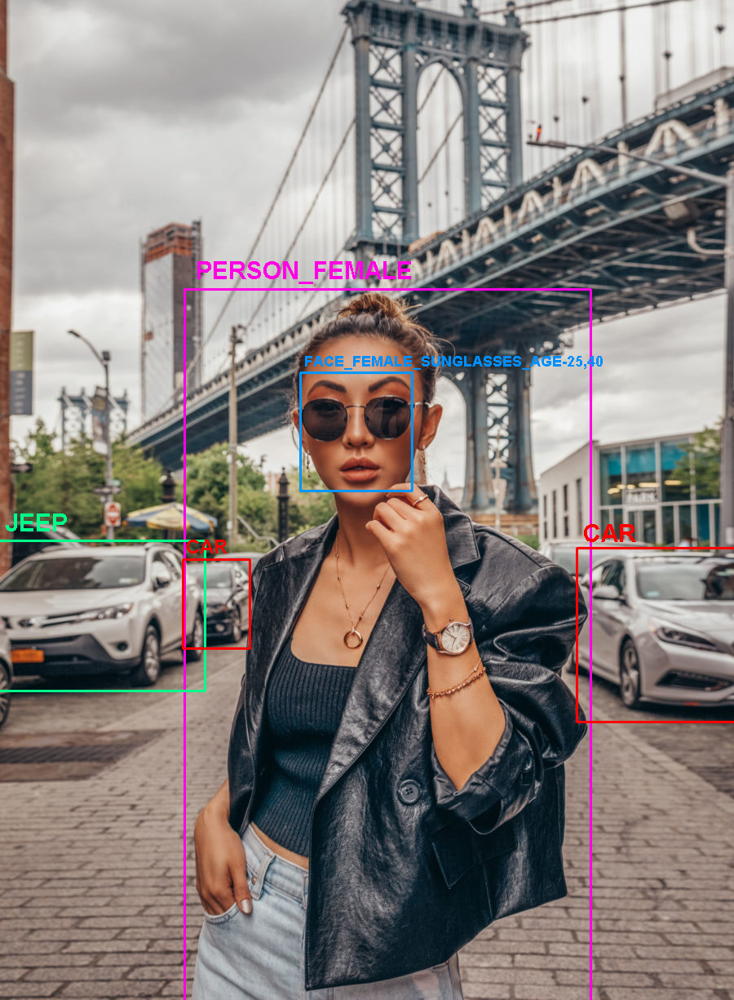
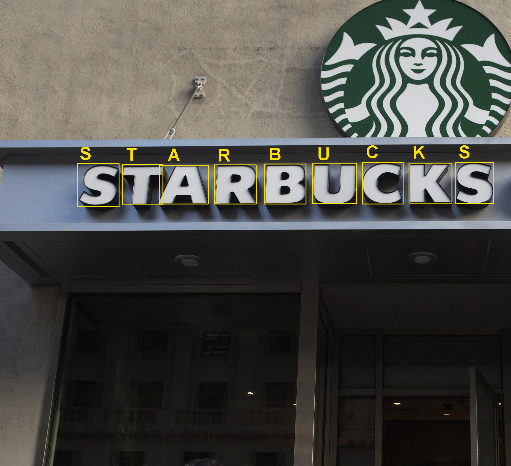
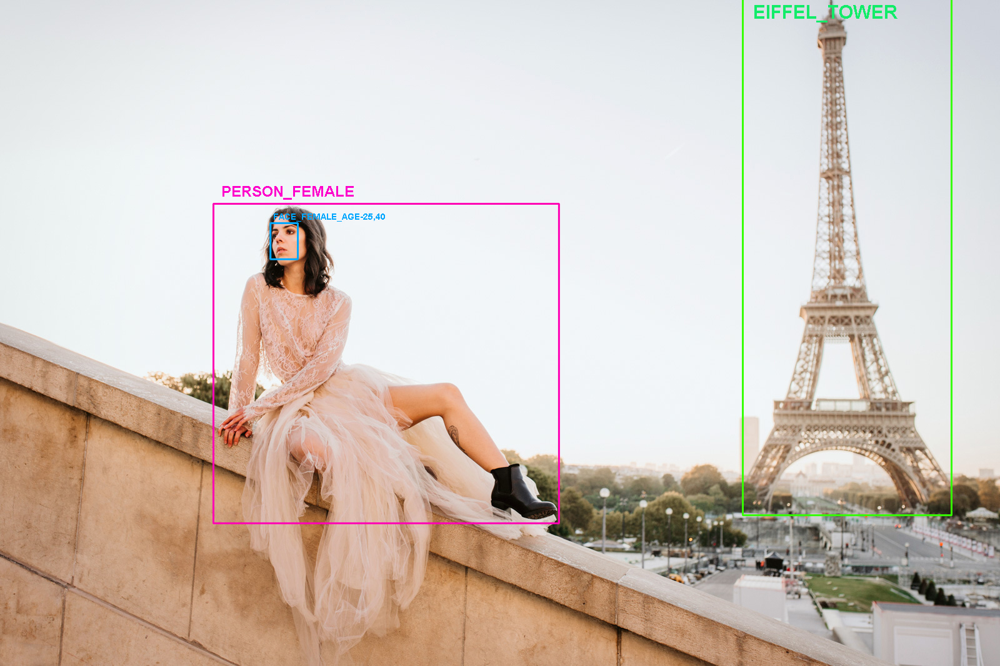

# YOLO-Darknet-object-detection
This model has 80 different classes for the moment,examples include but are not limited to;  
  Human Faces (with gender,age,eyewear subcategories) 
  Human Full/Partial Body (with only gender subcategory for the moment) 
  Vehicles (with type subcategory) 
  License Plates 
  Letters and Numbers (like an OCR module but more like in a photographic scene setting) 
  Signature landmarks around the world  

Model was built with a custom dataset and partially custom parameters like spp,work still in progress..
 
 
 

